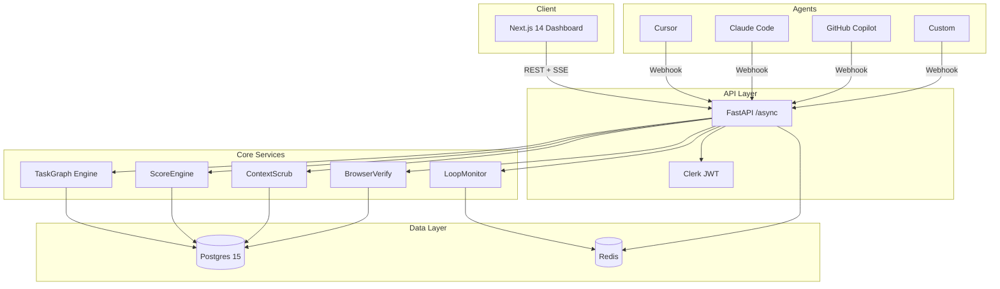

# Architecture

## System Design

## Data Flow

1. **Webhook arrives** from Cursor/GitHub/Slack
2. **GuardLoop creates a Task** with dependencies
3. **TaskGraph Engine** checks if dependencies are met
4. **Agent adapter** dispatches to the actual agent
5. **LoopMonitor** tracks iterations in real-time
6. **ContextScrub** scans every LLM call for PII
7. **ScoreEngine** calculates confidence when task completes
8. **BrowserVerify** runs if UI was touched
9. **Decision gate** auto-approves, reviews, or blocks
10. **SSE stream** pushes updates to the dashboard

## Scalability

- Backend: Horizontal Pod Autoscaler (3-20 replicas)
- Postgres: Read replicas for score queries
- Redis: Cluster mode for pub/sub at scale
- BrowserVerify: Dedicated node pool with GPU for visual regression
