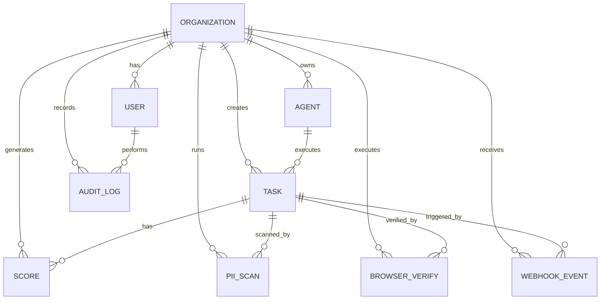

# Database Schema

## Entity Relationship Diagram

## Tables

### organizations
- `id` (PK, UUID)
- `name`, `slug` (unique), `clerk_org_id`
- `settings` (JSONB), `plan`
- `created_at`, `updated_at`

### users
- `id` (PK, UUID)
- `email` (unique), `clerk_user_id` (unique)
- `org_id` (FK), `role`, `preferences` (JSONB)

### agents
- `id` (PK, UUID)
- `org_id` (FK), `name`, `agent_type`
- `config` (JSONB), `status`, `last_seen`, `metadata`

### tasks
- `id` (PK, UUID)
- `org_id` (FK), `agent_id` (FK, nullable)
- `name`, `description`, `status`
- `parent_ids` (JSONB array), `child_ids` (JSONB array)
- `priority`, `max_loops`, `current_loop`
- `context_window` (JSONB), `context_size_tokens`
- `output` (JSONB), `error_log`
- `scheduled_at`, `started_at`, `completed_at`, `created_at`

### scores
- `id` (PK, UUID)
- `task_id` (FK), `org_id` (FK)
- `overall` (0-100)
- `test_score`, `coverage_score`, `security_score`, `behavioral_score`
- `weights` (JSONB), `test_details`, `security_details`, `behavioral_details`
- `decision`, `override_by`, `override_reason`

### pii_scans
- `id` (PK, UUID)
- `task_id` (FK), `org_id` (FK)
- `raw_context_hash`, `scrubbed_context_hash`
- `findings` (JSONB), `secrets_found` (JSONB)
- `blocked`, `block_reason`

### browser_verifies
- `id` (PK, UUID)
- `task_id` (FK), `org_id` (FK)
- `url`, `viewport` (JSONB)
- `screenshots` (JSONB), `a11y_violations` (JSONB)
- `visual_regression_score`, `passed`, `failure_reason`

### webhook_events
- `id` (PK, UUID)
- `org_id` (FK), `source`, `event_type`
- `payload` (JSONB), `signature`
- `processed`, `processing_error`, `task_id` (FK)

### audit_logs
- `id` (PK, UUID)
- `org_id` (FK), `user_id` (FK, nullable)
- `action`, `entity_type`, `entity_id`
- `before_state`, `after_state` (JSONB)
- `ip_address`, `user_agent`, `created_at`
